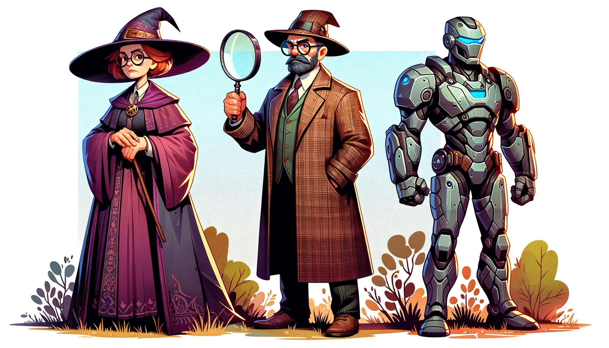

# Character Chat

### By Cory Suzuki (CS50 Python Final Project)

#### 2024-01-13

 

### Project Description:

Character Chat is a conversational AI program that allows users to interact with their favorite fictional characters from books, movies, and TV shows. Users can engage in conversations, ask questions, and receive responses from their chosen character. This project aims to let users interact with their favorite characters in a fun, engaging way and to allow users
to revisit their favorite stories.

### Video Demo: [URL HERE]

 

## How to Use

- **Step 1**: Download the .zip file called "character_chat.zip" from the <a href="https://github.com/MyPetLobster/character-chat">GitHub repository</a>. (if you are familiar with GitHub, you can clone the repository instead)

- **Step 2**: Extract the contents of the zip file to a folder on your computer.

- **Step 3**: Install Python. If you are using Windows, check if you have Python installed. You can do this by opening a Command Prompt and running the command `python --version`. If Python is not installed, download and install it from the official Python website (https://www.python.org/downloads/). **Make sure to check the option to add Python to your PATH during installation.**

- **Step 4**: Install dependencies. This project uses the OpenAI API, Rich library for styling the CLI output, and dotenv for storing and reading environment variables. To install these dependencies, open a Command Prompt and run the following command:
  `pip install - r requirements.txt`. The installations should only take a few moments. Once complete, check to make sure the dependencies were installed correctly by running the command `pip list`. There will be a list of installed packages, just make sure that you see the following packages: `rich`, `openai`, and `python-dotenv` and we are good to go!

- **Step 5**: **If your .env file already includes the API key, skip to Step 6.** Otherwise, create an OpenAI account. Go to https://beta.openai.com/ and create an account. Once you have created an account, go to the API Tokens page (https://beta.openai.com/account/api-tokens) and create a new API token. Then create a new file called `.env` within the `character_chat/` folder that you unzipped in Step 1. 
 
&nbsp;&nbsp;&nbsp;&nbsp;- To do this, open a Command Prompt and navigate to the `character_chat/` folder. 
 
&nbsp;&nbsp;&nbsp;&nbsp;- To confirm that you are in the folder, run the command `dir` (for Windows) or `ls` (for Mac or Linux), and you should see a folder called `/conversations/` as well as the following files: `character_chat.py`, `requirements.txt`, `README.md`, and `.env` (.env may be hidden by default).
 
&nbsp;&nbsp;&nbsp;&nbsp;- Then open the `.env` file in a text editor and paste the API key into the file after "OPENAI_API_KEY=". The file should look like this: `OPENAI_API_KEY=<your_api_key_here>`. (Don't include the "<" and ">" symbols. No spaces.) 
 
&nbsp;&nbsp;&nbsp;&nbsp;- Save the file and close it.

#### NOTE: By default, the program will use the GPT-3.5 Turbo model. However, the prompt is fine tuned for use with GPT-4. If you have access to GPT-4 and don't mind the increased API price, you can change the model to GPT-4 by changing the `engine` variable in the `character_chat.py` file from `engine = "gpt-3.5-turbo"` to `engine = "gpt-4"`.

#### NOTE: This README file was last updated on 2024-01-13. For updated model information and pricing, see the OpenAI pricing page at https://openai.com/pricing/.

- **Step 6**: Run the application. In the command prompt, navigate to the `/character_chat/` folder. To run the application, run the command `python character_chat.py`. The application will start and you will be prompted to enter the source material, character name, and context. Once you have entered the information, the conversation will begin. Enjoy!

- **Have a suggestion or want to report a bug?** Please submit an issue on the <a href="https://github.com/MyPetLobster/character-chat">GitHub repository</a> or email Cory Suzuki at admin@bookcasedatabase.com.

### NOTE: If you'd rather not bother with any of that, create a free account on Replit.com and run the program in the browser. You can find the program at https://replit.com/@CorySuzuki2/Character-Chat. Just press the "Run" button. If you see errors regarding OpenAI or API key, that means my API key has hit the monthly limit. Send me an email at admin@bookcasedatabase.com or feel free to use your own API key. Simply replace "OPENAI_API_KEY" with your actual key in this line -- 

`client = OpenAI(api_key=os.getenv('OPENAI_API_KEY'))`

 

# How it Works

Character Chat is built using OpenAI's GPT-3.5 Turbo model, which powers the AI conversation with fictional characters. Here's how the program operates:

1. **Initialization**:

   - Users start by specifying the source material (e.g., book, movie, show) and the name of the character they want to talk to.
   - Additional context or setting for the conversation can be provided, enhancing the role-play experience.

2. **Character Existence Check**:

   - The program checks if the specified character exists in the given source material.
   - If the character exists, it identifies the character's gender as 'male,' 'female,' or 'diverse' in
     order to set the color of the character's name in the chat.
   - If the character does not exist, the program responds with "no" and the program exits.

3. **Conversation with the Character**:

   - Users can engage in a conversation with the character, who will stay true to the character's personality and voice.
   - The AI character responds as the character would, drawing from the source material's context.
   - Users can continue the conversation until they choose to exit.
   - If users make the character too angry or uncomfortable, they have the agency to leave the conversation.

4. **Save Conversations**:
   - Users have the option to save their conversations with the character for later reference.

## Design Choices

- The program encourages users to immerse themselves in the character and engage in authentic role-play.
- It respects the character's personality traits, emotions, and reactions from the source material.
- Users can exit the conversation at any time by typing "quit."
- If the user strays from the character's world or asks questions the character wouldn't understand, the character may react accordingly, creating a dynamic and engaging experience.

Character Chat aims to bring joy and creativity to interactions with beloved fictional characters. Enjoy your conversations! Tell Voldemort he's a turd for me!

If you are interested in a more detailed look at the process of creating the application, see the <a href="https://mypetlobster.github.io/character-chat-process/">Character Chat Process</a>. I keep detailed notes on the process while working on projects. I like having the notes to look back on and reference.

For questions or support, please contact Cory Suzuki at admin@bookcasedatabase.com
